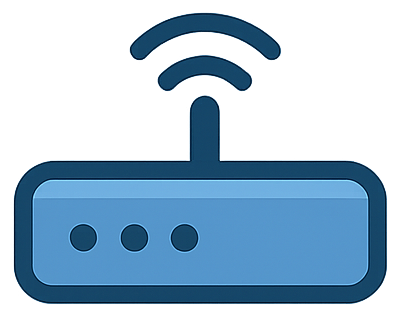
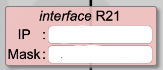
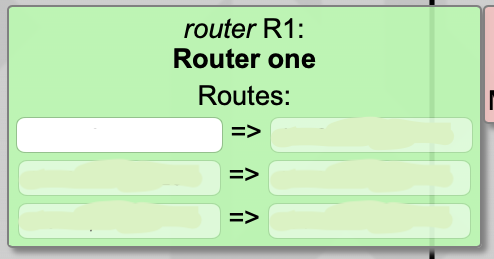

*This project has been created as part of the 42 curriculum by Laher Maciel. 42 username: lawences.*

# NetPractice

## Description

NetPractice is a practical networking exercise designed to introduce the basics of computer networking. The goal is to configure 10 small-scale simulated networks so that they function correctly, covering key concepts such as IP addressing, subnet masks, routing, and gateways.

Each level presents a non-functioning network diagram. The task is to modify the available fields (IP addresses, subnet masks, routes) until all objectives are met and the network operates properly.

## Instructions

### Running the training interface

1. Download and extract the project archive from the 42 project page.
2. Open a terminal in the extracted folder and run:
   ```bash
   bash run.sh
   ```
   This launches a local web server and opens the interface in your browser.

   If `run.sh` does not work, start the server manually:
   ```bash
   python3 -m http.server 49242
   ```
   Then navigate to `http://localhost:49242` in your browser.

3. Enter your 42 login in the field on the main page to load your personal configuration.

### Solving and exporting levels

- Adjust the unshaded fields in each diagram until the configuration is correct.
- Use **[Check again]** to verify your solution.
- Once a level is correct, click **[Get my config]** to download your configuration file.
- Repeat for all 10 levels.

### Submission

Place the 10 exported configuration files (one per level) at the **root of your Git repository** before submitting. Make sure your login was entered in the interface before exporting each file.

## Resources

### Networking concepts studied

- **TCP/IP addressing** — how IP addresses are structured and assigned across a network
- **Subnet masks and CIDR notation** — dividing address space into subnets, calculating network/broadcast addresses and usable host ranges
- **Default gateways** — how hosts route traffic destined for addresses outside their local subnet
- **Routers and routing tables** — longest-prefix matching, static routes, and default routes (`0.0.0.0/0`)
- **Switches** — Layer 2 forwarding within a single subnet
- **OSI model** — understanding where IP (Layer 3) and Ethernet (Layer 2) operate

### References

- [RFC 791 — Internet Protocol](https://www.rfc-editor.org/rfc/rfc791)
- [RFC 1918 — Private Address Space](https://www.rfc-editor.org/rfc/rfc1918)
- [Subnetting Practice — Subnet Guide](https://www.subnettingpractice.com/)
- [Cisco Networking Basics](https://www.cisco.com/c/en/us/solutions/enterprise-networks/networking-basics.html)
- [Professor Messer — TCP/IP Addressing](https://www.professormesser.com/network-plus/n10-008/n10-008-video/ipv4-addressing-n10-008/)

### AI usage

AI (Claude) was used during this project to:
- Clarify subnetting rules and verify subnet boundary calculations.
- Review understanding of routing table logic (longest-prefix match, missing return routes).

---

## Networking Reference

> The sections below are for anyone who wants to understand the underlying theory — from first principles through to routing tables. This is the material studied to complete the project, written so that even someone who has never studied networking can follow the logic.

*Credit: [caroldaniel/42sp-cursus-netpractice](https://github.com/caroldaniel/42sp-cursus-netpractice)*

### Table of Contents
1. [What is a Network?](#1-what-is-a-network)
2. [What are TCP and IP?](#2-what-are-tcp-and-ip)
3. [What is an IP Address?](#3-what-is-an-ip-address)
4. [What is a Subnet Mask?](#4-what-is-a-subnet-mask)
5. [What is CIDR Notation?](#5-what-is-cidr-notation)
6. [Private & Reserved IP Ranges](#6-private--reserved-ip-ranges)
7. [Network Devices](#7-network-devices)
8. [How a Router Connects to the Internet](#8-how-a-router-connects-to-the-internet)
9. [Routing Table](#9-routing-table)

---

### 1. What is a Network?

At its core, a **network** is a group of two or more devices that can send and receive data between each other. These devices are called **nodes**, and the data they exchange travels in small chunks called **packets**.

The Internet is the most well-known example — arguably the largest network ever built, connecting billions of devices across the world.

There are two broad categories:

- **Public network** — open to anyone connected to it, with little to no access control. The Internet is the prime example, typically operated by telecommunications companies to provide data services to the general public.
- **Private network** — restricted to a specific group of devices, such as a home or office. Only registered devices can exchange data, making it a much more controlled and secure environment. Your home Wi-Fi is a private network — your printer is accessible to devices on it, but not to anyone outside.

---

### 2. What are TCP and IP?

Moving data across a network requires agreed-upon rules — **protocols**. Different protocols handle different concerns (access, transport, security, etc.), each operating at its own layer of the communication process.

**TCP (Transmission Control Protocol)** handles the *how* of data transfer. It breaks data into packets, sends them across the network, and reassembles them at the destination — guaranteeing nothing gets lost along the way.

**IP (Internet Protocol)** handles the *where*. It assigns every device on a network a unique numerical address — an **IP address** — so packets know where to go.

TCP and IP are two separate protocols that work together. TCP splits and rebuilds the data; IP makes sure it reaches the right destination.

> There are two versions of IP: **IPv4** and **IPv6**. This guide covers only IPv4, the older and still most widely used version. From here on, "IP" means IPv4.

---

### 3. What is an IP Address?

An IP address uniquely identifies a device on a network.
It is a **32-bit number**, written as four groups of decimal digits separated by dots,
each group representing 8 bits (one **octet**), ranging from 0 to 255.

```
32 bits in 4 octets: 00000000.00000000.00000000.00000000
```

Each bit position in an octet has a value:

|  |  |  |  |  |  |  |  | Value |
|:---:|:---:|:---:|:---:|:---:|:---:|:---:|:---:|:---:|
|  |  |  |  |  |  |  | 0 | 0 |
|  |  |  |  |  |  |  | 1 | 1 |
|  |  |  |  |  |  | 1 | 0 | 2 |
|  |  |  |  |  | 1 | 0 | 0 | 4 |
|  |  |  |  | 1 | 0 | 0 | 0 | 8 |
|  |  |  | 1 | 0 | 0 | 0 | 0 | 16 |
|  |  | 1 | 0 | 0 | 0 | 0 | 0 | 32 |
|  | 1 | 0 | 0 | 0 | 0 | 0 | 0 | 64 |
| 1 | 0 | 0 | 0 | 0 | 0 | 0 | 0 | 128 |
| 1 | 1 | 0 | 0 | 0 | 0 | 0 | 0 | 192 |
| 1 | 1 | 1 | 0 | 0 | 0 | 0 | 0 | 224 |
| 1 | 1 | 1 | 1 | 0 | 0 | 0 | 0 | 240 |
| 1 | 1 | 1 | 1 | 1 | 0 | 0 | 0 | 248 |
| 1 | 1 | 1 | 1 | 1 | 1 | 0 | 0 | 252 |
| 1 | 1 | 1 | 1 | 1 | 1 | 1 | 0 | 254 |
| 1 | 1 | 1 | 1 | 1 | 1 | 1 | 1 | 255 |

So 255 is all 8 bits set to 1: `128+64+32+16+8+4+2+1 = 255`.

- 4 octets × 8 bits = **32 bits total**
- Each octet ranges from **0 to 255**
- Every device on a network needs a **unique** IP address

**Example — converting `192.168.1.13` to binary:**

| Octet | Calculation | Binary |
|:---:|:---:|:---:|
| 192 | 128+64 | `11000000` |
| 168 | 128+32+8 | `10101000` |
| 1 | 1 | `00000001` |
| 13 | 8+4+1 | `00001101` |

We always pad to 8 bits per octet, so `1` becomes `00000001` and `13` becomes `00001101`.

```
192.168.1.13 → 11000000.10101000.00000001.00001101
```

---

### 4. What is a Subnet Mask?

A subnet mask tells you which part of an IP address identifies the **network** and which part identifies the **host** (the device).

It is always a block of `1`-bits followed by a block of `0`-bits in binary. The `1`-bits mark the network portion; the `0`-bits mark the host portion.

```
255.255.255.0  →  11111111.11111111.11111111.00000000
                  |---------- network -------|  host  |
```

Taking `192.168.1.13` with subnet mask `255.255.255.0`: the parts where the mask is `255` are the network, and the last octet is free for host addresses. So `192.168.1` is the network and `.13` is the host.

That means we have **one network with 256 addresses** — but not quite all usable, because of two rules:

- **Network address** — the **first** address (`192.168.1.0`) represents the network itself and cannot be assigned to a device
- **Broadcast address** — the **last** address (`192.168.1.255`) is used to send data to all devices in the network simultaneously

So the actual **usable addresses** are `192.168.1.1` to `192.168.1.254`.

---

#### What if the mask isn't 255 in the last octet?

Take `255.255.255.240`. We know `255` in binary is `11111111`, and `240` is `128+64+32+16 = 11110000`.

```
255.255.255.240  →  11111111.11111111.11111111.11110000
```

Only 4 bits are left for host addresses → `2⁴ = 16` addresses per network.

**The block size trick — no binary needed:**

```
256 - last_octet_of_mask = block_size
```

```
256 - 240 = 16
```

```
block_size - 2 (Network address and Broadcast address) = usable addresses
```

```
16 - 2 = 14 usable
```

| Mask ends in | Bits for hosts | Block Size | Usable Addresses | Networks in last octet |
|:---:|:---:|:---:|:---:|:---:|
| 0 | 8 | 256 | 254 | 1 |
| 128 | 7 | 128 | 126 | 2 |
| 192 | 6 | 64 | 62 | 4 |
| 224 | 5 | 32 | 30 | 8 |
| 240 | 4 | 16 | 14 | 16 |
| 248 | 3 | 8 | 6 | 32 |
| 252 | 2 | 4 | 2 | 64 |
| 254 | 1 | 2 | 2 * | 128 |
| 255 | 0 | 1 | 1 * | — |

> \* `/31` and `/32` are special cases — they do **not** follow the network address and broadcast rules. See below.

---

#### Subnets in practice

With `255.255.255.240` (block size 16), your subnets in the last octet are:

```
.0   – .15   → network .0,   usable .1  – .14,  broadcast .15
.16  – .31   → network .16,  usable .17 – .30,  broadcast .31
.32  – .47   → network .32,  usable .33 – .46,  broadcast .47
... and so on
```

**Machine A** (`192.168.1.13 /28`) and **Machine B** (`192.168.1.1 /28`) → same network (`.0–.15`) ✅

**Machine C** (`192.168.1.17 /28`) → different network (`.16–.31`) ❌

---

#### Finding the network range — Bitwise AND

To find the exact range of a network given an IP and a mask, you apply a **bitwise AND**: go bit by bit, and keep a `1` only where **both** the IP and the mask have a `1`. Everything else becomes `0`. The result is the **network address** — the start of the range.

**Example — `21.23.143.3/14`:**

First, convert the mask. `/14` means 14 ones: `11111111.11111100.00000000.00000000` → `255.252.0.0`

Then AND with the IP:

```
IP:   00010101.00010111.10001111.00000011   (21.23.143.3)
Mask: 11111111.11111100.00000000.00000000   (255.252.0.0)
AND:  00010101.00010100.00000000.00000000   (21.20.0.0)
```

So the **network address** (range start) is `21.20.0.0`.

For the **range end**, use the block size trick on the relevant octet:
```
256 - 252 = 4  (block size on the second octet)
21.20.0.0 →  next network starts at 21.24.0.0
```
So the broadcast (range end) is `21.23.255.255`.

```
Range:     21.20.0.0  –  21.23.255.255
Usable:    21.20.0.1  –  21.23.255.254
```

**The rule in short:**
```
IP AND Mask = Network address (start of range)
Network address + block_size - 1 = Broadcast (end of range)
```

---

#### Edge cases: /31 and /32

**`/31` — mask `255.255.255.254` — 2 addresses:**
Used for point-to-point links between exactly two devices. No network address or broadcast needed.
```
Machine A: 192.168.1.254
Machine B: 192.168.1.255
```
Both addresses go directly to devices. *(You won't see this in Net Practice, but good to know.)*

**`/32` — mask `255.255.255.255` — 1 address:**
Every device is its own network. Used for specific host routes. *(You also won't see this in Net Practice, but also good to know.)*

---

### 5. What is CIDR Notation?

**CIDR** (Classless Inter-Domain Routing) is a shorthand that combines an IP address and its subnet mask. The number after the slash **counts how many `1`-bits** are in the mask.

```
255.255.255.240  →  11111111.11111111.11111111.11110000  →  28 ones  →  /28
```

So `192.168.1.13` with mask `255.255.255.240` can be written as `192.168.1.13/28`.

```
192.168.1.0/24   →  255.255.255.0    (24 ones)
10.0.0.0/16      →  255.255.0.0      (16 ones)
172.16.0.0/12    →  255.240.0.0      (12 ones)
```

| CIDR | Subnet Mask | Total IP Addresses | Usable IP Addresses |
|:---:|:---:|:---:|:---:|
| /32 | 255.255.255.255 | 1 | 1 * |
| /31 | 255.255.255.254 | 2 | 2 * |
| /30 | 255.255.255.252 | 4 | 2 |
| /29 | 255.255.255.248 | 8 | 6 |
| /28 | 255.255.255.240 | 16 | 14 |
| /27 | 255.255.255.224 | 32 | 30 |
| /26 | 255.255.255.192 | 64 | 62 |
| /25 | 255.255.255.128 | 128 | 126 |
| /24 | 255.255.255.0 | 256 | 254 |
| /23 | 255.255.254.0 | 512 | 510 |
| /22 | 255.255.252.0 | 1,024 | 1,022 |
| /21 | 255.255.248.0 | 2,048 | 2,046 |
| /20 | 255.255.240.0 | 4,096 | 4,094 |
| /19 | 255.255.224.0 | 8,192 | 8,190 |
| /18 | 255.255.192.0 | 16,384 | 16,382 |
| /17 | 255.255.128.0 | 32,768 | 32,766 |
| /16 | 255.255.0.0 | 65,536 | 65,534 |
| /15 | 255.254.0.0 | 131,072 | 131,070 |
| /14 | 255.252.0.0 | 262,144 | 262,142 |
| /13 | 255.248.0.0 | 524,288 | 524,286 |
| /12 | 255.240.0.0 | 1,048,576 | 1,048,574 |
| /11 | 255.224.0.0 | 2,097,152 | 2,097,150 |
| /10 | 255.192.0.0 | 4,194,304 | 4,194,302 |
| /9 | 255.128.0.0 | 8,388,608 | 8,388,606 |
| /8 | 255.0.0.0 | 16,777,216 | 16,777,214 |
| /7 | 254.0.0.0 | 33,554,432 | 33,554,430 |
| /6 | 252.0.0.0 | 67,108,864 | 67,108,862 |
| /5 | 248.0.0.0 | 134,217,728 | 134,217,726 |
| /4 | 240.0.0.0 | 268,435,456 | 268,435,454 |
| /3 | 224.0.0.0 | 536,870,912 | 536,870,910 |
| /2 | 192.0.0.0 | 1,073,741,824 | 1,073,741,822 |
| /1 | 128.0.0.0 | 2,147,483,648 | 2,147,483,646 |
| /0 | 0.0.0.0 | 4,294,967,296 | 4,294,967,294 |

> \* `/31` and `/32` are exceptions to the network address and broadcast rules.

---

### 6. Private & Reserved IP Ranges

Not all IP addresses are equal. Some ranges are **reserved** and cannot be used on the public internet. A private address cannot connect directly to the internet — a device needs a **public IP** to do that.

| IP Address Range | Purpose | Class | Number of IPs |
|:---|:---|:---:|---:|
| `10.0.0.0 – 10.255.255.255` | Private network | A | 16,777,216 |
| `127.0.0.0 – 127.255.255.255` | Loopback / internal testing | — | 16,777,216 |
| `172.16.0.0 – 172.31.255.255` | Private network | B | 1,048,576 |
| `192.168.0.0 – 192.168.255.255` | Private network | C | 65,536 |
| `224.0.0.0 – 239.255.255.255` | Multicast | — | 268,435,456 |
| `240.0.0.0 – 255.255.255.255` | Reserved / experimental | — | 268,435,456 |

Any address **not** in these ranges is a public address.

> `127.0.0.1` is the **loopback address** — it always refers to the device itself. A packet sent to `127.0.0.1` never leaves the machine. Useful for local testing.

---

### 7. Network Devices

#### Host

A **host** is any end device on a network — a computer, server, phone, etc.


---

#### Switch

A **switch** connects multiple devices within the **same network** (a LAN). It distributes packets between them but cannot communicate with other networks — it has no external interface.


```
Machine A                    Machine B
192.168.1.1 /24              192.168.1.120 /24
        \                        /
              [ SWITCH ]
        /                        \
Machine C                    Machine D
192.168.1.180 /24            192.168.1.240 /24
```

All four machines are in the same network (`192.168.1.0/24`) and can communicate freely through the switch.

---

#### Router

A **router** connects **multiple networks** together. It has one interface per network it connects to, and is responsible for forwarding packets between them.



Each interface has its own IP address and mask, placing it inside the network it connects to.



```
Machine A                    Machine B
192.168.1.1 /25              192.168.1.120 /25
        \                        /
              [ SWITCH ]
                  |
              [ ROUTER ]
              /          \
Machine C                    Machine D
192.168.1.130 /26            192.168.1.240 /26
```

Here we have three separate networks, all connected through the router:

- **Network 1** — `192.168.1.0/25` (`.0–.127`): Machine A and B, connected via the switch
- **Network 2** — `192.168.1.128/26` (`.128–.191`): Machine C
- **Network 3** — `192.168.1.192/26` (`.192–.255`): Machine D

The router has one interface per network and is responsible for forwarding packets between all three.

---

#### Internet


The **internet** node in Net Practice represents the public internet. To reach it, packets must pass through a router with a **public IP address**. Private IP addresses (like `192.168.x.x`) cannot reach the internet directly.

---

### 8. How a Router Connects to the Internet

When a device on a private network (like `192.168.1.5`) wants to reach the internet, it can't do so directly — private addresses are not routable on the public internet. The packet has to go through a **router that has both a private and a public interface**.

That router performs a process called **NAT (Network Address Translation)**. It swaps the private source address of the outgoing packet with its own public IP before sending it out. When the response comes back, it reverses the swap and forwards it to the original device. From the internet's point of view, all traffic from your private network appears to come from one single public IP — the router's.

> **Note for Net Practice:** NAT does not apply here. In Net Practice you work directly with public addresses on the router's external interface — there is no private-to-public conversion to worry about.

---

### 9. Routing Table

A **routing table** is stored in a router and lists all known routes to network destinations. In Net Practice it has two fields:



- **Destination** — the target network in CIDR notation (e.g. `190.3.2.252/30`). Use `0.0.0.0/0` or `default` to match any destination (default route — sends all unmatched traffic forward).
- **Next Hop** — the IP address of the next router the packet should be forwarded to in order to reach the destination.

---

#### Default Gateway — `0.0.0.0/0`

The default gateway is a catch-all route. When a router looks at its routing table and no specific destination matches the packet it's trying to forward, it falls back to the default gateway and sends it there.

The `0.0.0.0/0` notation means "match any IP address" — since the mask is all zeros, no bits need to match, so every destination qualifies. It always has the lowest priority though, meaning specific routes always win over it.

What sits at the other end of that route can be anything — another router, a specific interface, or the internet node. It's simply saying *"when in doubt, send it this way."*
